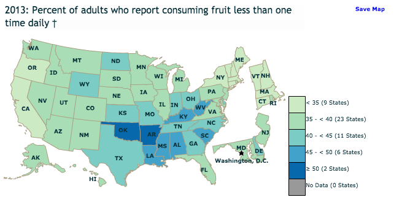
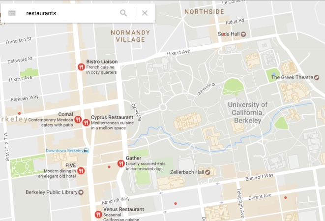

##  Introduction

This tutorial was prepared for a D-Lab Workshop on Creating Maps in R, November 13, 2015. It draws on our experience as well as the many helpful related tutorials available online, referenced at the bottom of this document.

### About
- Prepared for the D-lab workshop Creating Maps in R
- By Patty Frontiera & Shinhye Choi
- See: dlab.berkeley.edu
- contact: schoi [at] berkeley.edu with suggestions


### Learning Goals

- Introduce geographic data, coordinate reference systems and R SP spatial data objects.
- Provide example code & tips for creating maps in R using the base plotting system, ggplot2 & ggmaps packages.
- Explore basic map types including dot maps, proportional symbol maps, and choropleth maps.

### Use Cases

The content of this tutorial provides guidance for:

- creating a reference map for your document or presentation,
- adding geographic data to a basemap like Google Maps data,
- creating maps using your own geographic data.

### Prerequisites

- Basic knowledge of R and ggplot assumed.
- Basic knowledge of geographic data is highly recommended.

### Limitations

- This is a tutorial with a limited scope, not a comprehensive reference.
- This tutorial only addresses the use of vector data (points, lines, and polygons) and not raster (grid) data.
- Only a very cursory introduction to geographic data and R spatial data objects is provided.

## Getting Started

### Instructor notes

- This tutorial should take approximately 2.5 hours with instructor guidance.
- Students should be told in advance to bring a laptop to the workshop with R, RStudio & packages installed.
- The code is a bit long and complex and is meant to serve as a reference. Thus, make this document available for students to copy from or cut and paste.
- There are several opportunities for students to extend or change the code for practice. 
- Leave time for students to enter and run the code, e.g., take a break every **20 minutes** to get everyone caught up.
- At the end of the workshop students should be encouraged to check out the links in the References section.

### Student Preparation

- Download the tutorial data from the online GitHub repository for this tutorial: 
    - Go to: https://github.com/dlab-geo/RGeoPlotting
    - Click on the **Clone or Download > Download ZIP** button
    - Unzip the tutorial zipfile - the data will be in the **data** directory
- Make a note of the directory, or folder, on your computer to which this data have been downloaded.
- In a web browser, open the **tutorial/R_geoplotting_tutorial_v2017.html** file to follow along.
- Open RStudio on your laptop and create a new script file. Save it as **geoplotting.R**.
- Type or cut and paste the tutorial code into this script file to run it.

## R Packages

### Clean slate 

Make sure what you do and what you see in R is not a result of commands you previously ran. To do this, remove any objects in memory or your environment. This shouldn't be needed if you just opened RStudio.

```{r}
rm(list = ls())
```

<br>

Set your working directory to the directory (or folder) on your computer that contains the tutorial data. This is where R will write output files and look for input. If you have created an Rstudio project (File -> New Project) for this training you won't need to change the directory. The **RStudio Session > Set Working Directory > Choose Directory** is another way to set your working directory and get the command syntax.

```{r, eval=FALSE}
setwd("~/Documents/Dlab/dlab_workshops/RGeoPlotting/data") # or local folder on Mac / *nix computer
#setwd("~/Dropbox/Dlab/dlab_workshops/RGeoPlotting/data")    # Could also be a dropbox folder (smart!)
#setwd("c:/docs/Dlab/dlab_workshops/RGeoPlotting/data")      # MS Windows OS stye
```

<br>

### Load Required Packages

Below is some useful code that will:

```{r, eval=FALSE}

# Make a vector of the packages used by this tutorial
required.pkg <- c("maps", "ggplot2", "ggmap", "maptools", "rgdal", "sp", "dplyr", "tidyr", "scales", "RColorBrewer", "classInt")

# Identify any uninstalled packages
pkgs.not.installed <- required.pkg[!sapply(required.pkg, function(p) require(p, character.only=T))]

# Install any needed packages that are not currentlty installed
if(length(pkgs.not.installed) > 0) {
  install.packages(pkgs.not.installed, dependencies=TRUE)
} else {
  print("All required packages installed.")
}

# Load all libraries them all at once.
lapply(required.pkg, library, character.only = TRUE)         

```

### About the Libraries 

The R libraries used in this tutorial provide the following functionality:

- **maps**: a library for accessing geographic data for regions in the world.
- **maptools:** tools for reading and handling spatial objects
- **sp:** tools for creating and working with spatial data objects
- **ggplot2**: a powerful all-purpose plotting library that supports map creation
- **ggmap**: extends ggplot2 to provide access to online basemaps like Google Maps and OpenStreetMaps. Also provides access to services like the Google Geocoding API (geocode()), the Google distance matrix API (mapdist()), and the Google Directions API (route())
- **rgdal**: powerful toolkit for importing and transforming different spatial data types and providing access to the *proj4* library for working with map projections and coordinate reference systems
- **dplyr**, **tidyr**: for data cleaning, transformation and manipulation
- **scales**: for data scaling transformation functions to improve visualizations
- **RColorBrewer**: for selecting predefined color palettes.
- **classInt**: for identifying break points based on data set values using standard classification schemes - equal interval, quantile, natural breaks, standard deviations, etc.

<br>
With any of these libraries you can get help documentation in RStudio by entering a question mark followed by the library name, e.g. `?ggmap`. You can also do a web search, eg `R package ggmap` for more comprehensive documentation. We recommend trying both when you are using a new library.

<br>

## Geographic Data

### Fundamentals

Geographic data are observations about locations on or near the surface of the Earth. For example:

- Discrete Entities
    - buildings, roads or water fountains
    - city, county, state boundaries
- Continuous phenomena
    - air or ocean temperature
    - elevation, soil type, land use
- Events
    - locations of crimes, concerts, protests

### Representing Location

When geographic locations are represented as text data, like Berkeley CA or Gourmet Getto, we typically treat those locations as categorical values in our data set. For example,
```{r, eval=FALSE}
# 2013: Percent of adults who report consuming fruit less than one time daily†
# https://nccd.cdc.gov/NPAO_DTM/IndicatorSummary.aspx?category=21&indicator=37&year=2013&yearId=17
fruit_data <- read.csv("fruit_consumption.csv")
head(fruit_data)

```

Categorical location data makes its hard to explore spatial characteristics in the data like "are there any regional trends?"
For that you need a map and to make a map you need to have geometric representations of geographic locations.

</img>


### Geospatial Data

Geospatial data have geometric representations of geographic locations and attributes that describe those locations. Spatial data is a more generic term that can be used for both geographic and non-geographic data.

There are two main types of spatial data: **vector** & **raster** data.
 
### Raster Data
Raster data represent location as a gridded surface where each grid cell has a value for the phenomena being mapped, eg temperature. Grid cells are typically uniform and square and are rendered digitally as pixels. Grid cells have a dimension, eg a 30m raster consists of 30x30m cells whose value is representative of a 900 sq meter area.  

</img>

### Vector Data
Vector data represent location as one or more sets of x,y coordinate pairs. There are three types of spatial vector data objects: `points`, `lines`, and `polygons`.


To be truly useful and meaningful, these objects are combined with descriptive attributes that together describe real world geographic features and phenomena. 
 


Discrete real world geographic entities and events are typically represented with vector objects. Continuous phenomena are more often represented with raster data.
 
#### *This tutorial will focus on vector data*

## Geographic Data in R

Let's create a map of some cafes in Berkeley using R's basic `plot()` function.  First, read in the data from a `CSV` file and take a look. CSV files are one of the most commonly used file formats for geographic data.

```{r, eval=FALSE}
cafe <- read.csv("cafe.csv")
head(cafe)
```


Let's take a closer look at the data
```{r, eval=FALSE}
class(cafe)
str(cafe)
```

#### Questions
- What type of geographic data are `cafes`?
- Are `cafes` geospatial data?

<button>Answer</button>
<p style="display: none">Answer: (1) They are vector points. (2) Because the data contain longitude and latitude values.</p>
<script>
$( "button" ).click(function() {
  $( "p" ).toggle();
});
</script>

### Coordinate Reference Systems

Points, lines, polygons & grids are geometric objects. When those geometries are referenced to the surface of the earth they can represent geographic locations.  We do this by defining a coordinate reference system (CRS) for those objects.

Geographic coordinates are expressed as **longitude** and **latitude**.

- *latitude* tells us how far we are north or south of the equator, the zero degree of latitude. Values range from +90 (north pole) to -90 degrees (south pole).
- *longitude* tells us how far east or west we are of a specified prime meridean, currently defined by international standard as the Greenwich Meridian, the zero degree of longitude. Values range from +180 to -180 (which are the same location! approximately the international date line).


</img>


For a number of reasons working with longitude & latitude values are tricky. One issue is that folks often treat longitude & latitude as respectively analogous to the x and y coordinates in a 2D Euclidean plane. However, geographic coordinates are angular measures on a 3D model of the earth.

A **geographic coordinate system** or **GCS** specifies longitude and latitude on reference surface defined by an origin (zero degrees of latitude and longitude) and a datum. A **datum** is an ellipsoidal model of the shape of the earth and a set of ground control points that fit data to specific locations on the Earth. The key takeaway here is that to properly interpret latitude and longitude values you need to know their GCS. And there area many GCS. Fortunately, only two GCSs are widely used today

- [WGS84](https://en.wikipedia.org/wiki/World_Geodetic_System): the World Geodetic System of 1984 GCS
- [NAD83](https://en.wikipedia.org/wiki/North_American_Datum#North_American_Datum_of_1983): The North American Datum of 1983 GCS

These can be considered identical for locations within the USA when sub-meter accuracy is not required. 

*More detail is beyond the scope of this tutorial.*

## Spatial Data in R

Our `cafe` data frame has longitude and latitude values but it is not a spatial data object that can be mapped.  To make our cafes spatial data we use the `SP` package.

### The `SP` Package

The `SP` package is most commonly used to provide support for vector data objects in R. Most other R packages that do things with spatial data work with SP objects.

```{r, eval=FALSE}
library(sp)
?sp
```

Let's take a look at the different classes of spatial data objects in the *sp* package:
```{r, eval=FALSE }
getClass("Spatial") 
```

#### Take a few minutes to look at some different types of Spatial data objects
```{r, eval=FALSE}
# SpatialLines
getClass("Line")
getClass("Lines")
getClass("SpatialLines")

# SpatialPolygons data
getClass("SpatialPolygons")
```

The three main types of spatial objects that you will use in R are summarized below.

<style>
   th,td{
     padding:5px 5px 5px 5px;
   }
</style>
<table border=1 >
<tbody>
<tr><th>Vector Data Type</th><th>SP Spatial Class</th><th>SP Spatial Class with Attributes</th></tr>
<tr><td>Points</td><td>SpatialPoints</td><td>SpatialPointsDataFrame</td></tr>
<tr><td>Lines</td><td>SpatialLines</td><td>SpatialLinesDataFrame</td></tr>
<tr><td>Polygons</td><td>SpatialPolygons</td><td>SpatialPolygonsDataFrame</td></tr>
</tbody>
</table>
<br> 

Let's convert the cafe data frame to a SpatialPointsDataFrame using the SP function `coordinates`.
```{r eval=FALSE}
?coordinates

coordinates(cafe) <- c("long","lat") # or ~long+lat
head(cafe)
class(cafe)
str(cafe)
```

#### SpatialPointsDataFrame
You can see from `str(cafe)` that the cafe SPDF object is a collection of `slots` or components. The key ones are:

- @data: the attribute data describing each location
- @coords: the coordinates for each location
- @bbox: the min and max lon(x) and lat(y) coordinates tthat together define the minimum bounding box around the locations
- @proj4string: the coordinate reference system defintion as a string

You can read the help page for SPDF
```{r, eval=FALSE}
?SpatialPointsDataFrame
```

Explore the SpatialPointsDataFrame
```{r, , eval=FALSE}
cafe@bbox
head(cafe@coords)
head(cafe@data)
head(cafe$name)
```

### Defining the Coordinate Reference System (CRS)

Geospatial data have a CRS - that is what makes the data geospatial. In order for the software to know what it is it needs to be defined and stored with the SP object. The `@proj4string` slot contains the CRS definition.  If you take a look at the CRS for the cafe SPDF you will see that it is undefined.

```{r, eval=FALSE}
cafe@proj4string
```

Since we know that the cafe points are encoded as longitude and latitude coordinates we can safely define the CRS as follows:

```{r, eval=FALSE}
?proj4string
?CRS #SP
proj4string(cafe) <- CRS("+proj=longlat + ellps=WGS84")
cafe@proj4string
```

Above we define the CRS as [WGS84] - the World Geodetic System of 1984 GCS. 

Note, we are not doing any transformation on the data. We are just identifying the CRS for the coordinates used by the data. If we define the wrong projection (and we can) we will get errors and erroneous results when we apply spatial operations on the data.


## Creating a Point Map

A point map is the simplest type of map. You are likely very familiar with this type of online point map:

 </img>


Create a simple point map of the parks using the R base `plot` method.
```{r, , eval=FALSE}
plot(cafe, pch=21, col="black", bg='palegreen') # all cafes  
plot(cafe[cafe$taste > 6,], pch=21, col="black", bg="darkgreen", add=T) # What does this line do?
```


### Subsetting a SPDF
```{r, , eval=FALSE}

great_cafes <- subset(cafe, taste > 6) # works just like a data frame!
# but don't do this: 
# great_cafes <- subset(cafe@data, taste > 6)

# now map it
plot(cafe, pch=21, col="black", bg='palegreen') # all cafes  
plot(great_cafes, pch=21, col="black", bg="red", add=T)  
```

The [Quick-R Graphical Parameters](http://www.statmethods.net/advgraphs/parameters.html) web page has some handy reference material for point symbols and colors.


> **Challenge**
> Plot all of the cafes but highlight cafe Strada using a different color (`bg` or `col`) and symbol (`pch`)

## Working with Shapefiles

CSV data is often used with point data but rarely with more complex line and polygon data. These data are more typically stored in [ESRI Shapefiles](https://en.wikipedia.org/wiki/Shapefile). Since this format is so widely used let's load some more data for Berkeley that is in this format.

We will use the `rgdal` library to load the shapefile data. The `rgdal` library is the most commonly used R library for importing and exporting spatial data.  It is based on the powerful and widely used `GDAL/OGR` libraries. See [gdal.org](http://gdal.org) for details. For more info on working with `rgdal` to load different types of spatial data in R see this excellent [tutorial](http://zevross.com/blog/2016/01/13/tips-for-reading-spatial-files-into-r-with-rgdal/) by Zev Ross. His blog has a wealth of information about working with spatial data in R.

Let's take a look at some data we have in our working directory and load then load it into R using the rgdal function `readOGR`.

```{r, eval=FALSE}
ogrInfo(".", "uc_bldgs")  # You can look at the data contents without reading in the data
uc_buildings <- readOGR(dsn=".", layer="uc_bldgs") # read data into R
```

A few words about reading in shapefiles with readOGR. The `dsn` value indentifies the directory in which the shapefile is located. When it is  `dsn="."` that means the data is in the current working directory. The `layer` value is the name of the shapefile without the `.shp` file extension.

Examine the shapefile data
```{r, eval=FALSE}
summary(uc_buildings)
str(uc_buildings@data)
class(uc_buildings)
nrow(uc_buildings)
```

> Question:
> What type of object is `uc_buildings?`
> How many buildings are there?


#### Let's load some other data
```{r, eval=FALSE}
uc_boundary <- readOGR(dsn=".", layer="uc_bnd") # ucb boundary within Berkeley
census_blks <- readOGR(dsn=".", layer="censusblk") # Berkeley 2010 census blocks
```


### Map Overlays

Let's make a map of all of our Berkeley data. Note the new commands.
```{r, eval=FALSE}
plot(uc_boundary, border="blue")
plot(census_blks, add=T)
plot(uc_buildings, col="red", add=T)
points(cafe, col="green", pch=20)
```


#### Why can't we see our cafe points?
```{r, eval=FALSE}
proj4string(cafe) == proj4string(uc_buildings)
cafe@proj4string
```

> Question
> What is the CRS for the other Berkeley Data? Do they all have the same CRS?

## Map Projections

The CRS for the Berkeley boundary, buildings and census block data looks much more complicated than that for the cafe data:

```{r, eval=FALSE}
uc_buildings@proj4string
```
```
CRS arguments:
 +proj=lcc +lat_1=37.06666666666667 +lat_2=38.43333333333333 +lat_0=36.5 +lon_0=-120.5 +x_0=2000000
+y_0=500000.0000000001 +datum=NAD83 +units=us-ft +no_defs +ellps=GRS80 +towgs84=0,0,0
```

What does that mean? These data use a `projected CRS` called`California State Plane Zone III, units feet, based on the NAD83 GCS`.

A projected CRS is one for which a `Map Projection` has been applied to data in a geographic `CRS`.

Let's take a minute to explain map projections and projected CRSs, especially, why these are necessary for spatial measures like area, length.

### What is a Map Projection?

Because the world isn’t flat Map Projections are used to convert locations on a 3D surface to a 2d plane. A map projection is a mathematical model that enables this coordinate transformation.  Needless to say, this process introduces error sinces it is impossible to convert a 3D surface to 2D plane without introducing distortion.

</img>

There are three main types of projections: 

- conformal: preserves shape and direction
- equal area: preserves area
- compromise: preserves nothing, tries to minimize distortion

> Question?
> Is the the northern edge of Maine farther north than that of Washington?


### What is a Projected CRS?

A projected CRS locates geospatial data in a 2D plane. The `proj4string` defines how a map projection is applied to coordinate data in a GCS. It specifies the map projection, the input GCS of the data, the origin, and any other needed parameters that enabled the transformation.

Good projected CRSs for CA data include:

- `EPSG 3310`: CA ALbers Equal Area, NAD83, units m 
    - http://spatialreference.org/ref/epsg/3310/
- `EPSG 26910`: EPSG UTM Zone 10N, NAD83, units m
- `CA State Plane`, Zone I - VI, NAD83, units ft or meters

Here are some useful references:

- http://neondataskills.org/R/vector-data-reproject-crs-R/
- https://en.wikipedia.org/wiki/Map_projection
- https://en.wikipedia.org/wiki/Geographic_coordinate_system
- ESRI, 2004. Understanding Map Projections, pp 1-21. (available via web search). 
- http://spatialreference.org (for EPSG codes)

### Why use Map Projections and Projected CRS?

- Printed maps and computer screens are 2D so unprojected Geographic CRS data is distorted when displayed.
- Most software for working with geospatial data, including R, only support spatial analysis operations on projected data.

### CRS Transformations
In order to map or analyze more than one spatial data object they must have the same CRS.  You can use the `spTransform` function to transform spatial data from one CRS to another. This transformation is also called `projecting` or `reprojecting`.

Since data in a projected CRS are more useful let's transform the cafe data to the same CRS as the other Berkeley data. 

```{r, eval=FALSE}

cafe_sp3 <- spTransform(cafe, CRS("+proj=lcc +lat_1=37.06666666666667 +lat_2=38.43333333333333 +lat_0=36.5 +lon_0=-120.5 +x_0=2000000 +y_0=500000.0000000001 +datum=NAD83 +units=us-ft +no_defs +ellps=GRS80 +towgs84=0,0,0"))

# or more simply
cafe_sp3 <- spTransform(cafe, CRS(proj4string(uc_boundary)))

```


Re-create the map using the code above but this type map `cafe_sp3`. Do you see the cafes now?

```{r, eval=FALSE}
plot(uc_boundary, border="blue")
plot(census_blks, add=T)
plot(uc_buildings, col="red", add=T)
points(cafe_sp3, col="green", pch=20)
```

#### Saving Maps

```{r, eval=FALSE}

# Save our map to a PNG File
png(file = "map1.png")
plot(uc_boundary, border="blue")
plot(census_blks, add=T)
plot(uc_buildings, col="red", add=T)
points(cafe_sp3, col="green", pch=20)
dev.off()


# Save our map to a PDF File
pdf(file = "map2.pdf", height = 6, width = 8)
plot(uc_boundary, border="blue")
plot(census_blks, add=T)
plot(uc_buildings, col="red", add=T)
points(cafe_sp3, col="green", pch=20)
dev.off()

```

## Choropleth Maps

Choropleth maps symbolize areas by data values. They are extremely powerful method of data visualization and are a bit like geographic histograms in that they show they spatial distribution of data values. Choropleth maps use color to convey data values. Selecting appropriate colors is an important part of the process of making choropleth maps. 

Let's take a minute to look at (http://colorbrewer.org).

### rColorBrewer Package
In R, we use the `rColorBrewer` package to select color palettes. Read the package help for more info.

```{r, eval=FALSE}
?ColorBrewer # access help pages
display.brewer.pal(3,"Set3") # view a color palette
```

### Types of Color Palettes:

- Qualitative - complementary colors, e.g. pastels, to emphasize different categories
- Sequential - a range of different shades of the same color (hue) to imply higher to lower ranks or values
- Divergent - two squential color palettes with a light or grey color in the middle; used to emphasize outliers

```{r, eval=FALSE}
display.brewer.all(type="qual")
display.brewer.all(type="seq")
display.brewer.all(type="div")
```


We will use choropleth maps to explore Berkeley census data.

### Map Census Data for Berkeley

Before creating a choropleth map, its a good idea to explore the range of data values that will be mapped.
```{r, eval=FALSE}
head(census_blks@data)
str(census_blks@data)
summary(census_blks$POP_DENS)
hist(census_blks$POP_DENS)
summary(census_blks$WHITE)
hist(census_blks$WHITE)
summary(census_blks$ONE_PARENT)
hist(census_blks$ONE_PARENT)
```

```{r, eval=FALSE}
# let's look at the census attribute data
# plot white pop density for each block
# don't use class as a var name as it is reserved word
# library(classInt)
myclass <- classIntervals(census$WHITE, 5, style = "quantile")
colpal  <- findColours(myclass, brewer.pal(5, "BuGn"))
plot(census, border="grey", col=colpal)
plot(uc_boundary, add=T, border="blue", lwd=2)
plot(uc_buildings, add=T)
```

Take a look at the help pages for some of those commands
```{r, eval=FALSE}
?classIntervals
?findColours
```

Map some other variables using different color palettes
```{r, eval=FALSE}
# pop density 
myclass <- classIntervals(census$POP_DENS, 5, style = "quantile")
colpal<- findColours(myclass, brewer.pal(5, "OrRd"))
plot(census, border="grey", col=colpal)
plot(uc_boundary, add=T, border="blue", lwd=2)
plot(uc_buildings, add=T)

# rent
myclass <- classIntervals(census$RENT, 5, style = "quantile")
colpal<- findColours(myclass, brewer.pal(5, "PuRd"))
plot(census, border="grey", col=colpal)
plot(uc_boundary, add=T, border="blue", lwd=2)
plot(uc_buildings, add=T)
```

> **Challenge**
> Make a choropleth map using a divergent color palette.
> Make a choropleth map using a differnt classification method for binning the data.

## Creating Maps with ggplot2

Lots of R packages install demo data or provide functions for accessing remote data. We will start by creating some ggplot maps with built-in data from the `maps` package.

### The maps package
Let's retrieve geographic data for creating a map from the **maps** package.
You can use the command **data()** to see all data available from all of the installed packages and **data(package="package-name")** to see data included in a specific R package.


```{r, eval=FALSE}
#library(maps) #Load the maps package if not already loaded
data(package="maps") # See what data are available in maps package
```

Once we load the package, we can load a data set and explore it.
```{r, eval=FALSE}
world <- map_data("world")  # Load the world data into the object called world
                            # map_data is a function in ggplot for loading data from
                            # the maps package
```


### ggplot2

Created by Hadley Wickham, **ggplot2** is perhaps the most widely used R package for creating plots, charts & maps. People who use ggplot are familiar with its syntax. However, newcomers to the package may find it non-intuitive.  There are many online tutorials and cheat-sheets for using ggplot. Some starting points are listed at the end of this tutorial.


### ggplot2 - jump start

Use the ggplot2 package to create a map of the world data.

```{r, eval=FALSE}
#library(ggplot2) # load the library if not already loaded

ggplot(world, aes(x=long, y=lat)) +   
  geom_path(aes(group=group))

# or

ggplot() + geom_path(data=world, aes(x=long, y=lat, group=group))  
```

#### Important notes:

- The plus sign that chains the command syntax should always be on the right, else may cause errors!
- The second syntax structure is clearer when overlaying multiple **geom_** types.
- The ggplot2 **aes()** or aesthetic function associates the data to specific plot elements. 
- You may have used the *qplot()* function (short for quick plot) in ggplot to create plots with non-geographic data. However, qplot() does not have the full functionality of ggplot() and in particular cannot layer different data objects on the same plot - an activity that is very common in map making (i.e., map overlay). Thus, qplot will not be covered in this tutorial.

See the **ggplot2** documentation to dive into the details of the ggplot() syntax. 


### More on the World

Let's talk about the **world** object 
```{r, eval=FALSE}
head(world) # Take a look at the first few rows of data
tail(world) # Take a look at the last few rows of data
dim(world) # How many rows and columns
str(world) # Take a look at the data types
```

> Questions:
- What does each row in the data frame contain?
- What are the columns `group`, `order` used for? 
- Why do they matter?


### Geographic Data and ggplot

We previously worked with geographic data in `SP` objects. The **ggplot** package requires geographic data to be in an R data frame!

### Structure of a ggplot data frame for geographic data 

- **long** is longitude in decimal degrees as a numeric data type. Longitude values range from +-180 degrees east or west of prime meridian (running through Greenwich, England - just outside of London).
  - You may also see projected map coordinates in the long column (confusing) or in a column labeled **X**.
- **lat** is latitude. Latitude values range from +-90 degrees north or south of the equator.
  - You may also see projected map coordinates in the lat column (confusing) or in a column labeled **Y**.
- **group** identifies a set of points. One lat/long pair is a point, points with the same group can be connected as a path/line or polygon. For example each island in the United Kingdom is a group.
- **order** tells us the order with which to connect the points (think connect-the-dots).
- **region** and subregion identify named features. For example, in the world data frame all island groups within the United Kingdom have the region value "UK" and "Scotland" is one subregion.

### Mapping regions

A country may include multiple regions. The data for these regions are stored as polygons, defined by groups of ordered points.
- Which country do you think should have more data points delineating its boundary - Canada or India? Why?

```{r, eval=FALSE}

# Sum the number of rows for India
sum(world$region == "India")

# Compare
sum(world$region == "India") > sum(world$region == "Canada")

```

### Plotting a Region

Let's create a map of one region - India
```{r, eval=FALSE}
 
ggplot(world[world$region=="India",], aes(x=long, y=lat)) +   
              geom_path(aes(group=group))    
```

#### What didn't look right? 

Compare that map to this one:
```{r, eval=FALSE}

ggplot(world[world$region=="India",], aes(x=long, y=lat)) +   
  geom_path(aes(group=group)) + coord_map("mercator") 

```
Does that look better? Why?

### Now map Canada
Edit the code we used above to create a map of Canada or another country of your choice.

### Assigning a plot to a variable

You can assign a plot to a variable name (see **p2** below) and then display the plot by entering the variable name in the R console. That way you can display or add to the plot without having to re-input all that code!
```{r, eval=FALSE}

p2 <- ggplot(world[world$region=="India",], aes(x=long, y=lat)) +   
        geom_path(aes(group=group)) + coord_map("mercator") 
p2
```

### Exploring North America

Let's subset the **world** data to extract North America locations only.
```{r, eval=FALSE}
north_a_countries <- map_data("world", region=c("USA", "Canada"))
north_a <- subset(north_a_countries, long < -50 & lat > 20)
```
What is the difference between **north_a_countries** and **north_a**? Plot them to compare

### Plot North America using geographic coordinates
```{r, eval=FALSE}

# Countries
ggplot(north_a_countries, aes(x=long, y=lat)) +
  geom_polygon(aes(group=group))
  
# Countries subset by coordinate values  
ggplot(north_a, aes(x=long, y=lat)) +   
  geom_path(aes(group=group))

```
### Plot North America using the mercator map projections

Is there still distortion?

```{r, eval=FALSE}
na_plot <- ggplot(north_a, aes(x=long, y=lat)) +   
              geom_path(aes(group=group))
              
# Add a plot option to a plot variable!
na_plot + coord_map("mercator")

# and display it
na_plot
```

### Points, Lines, & Polygons

What's different in the code below and why:
```{r, eval=FALSE}
ggplot(north_a, aes(x=long, y=lat)) +
  geom_polygon(aes(group=group)) + coord_map("mercator")

ggplot(north_a, aes(x=long, y=lat)) +
  geom_point(aes(group=group)) + coord_map("mercator")

ggplot(north_a, aes(x=long, y=lat)) +
  geom_path(aes(group=group)) + coord_map("mercator")
```

### Symbolizing Paths (or Lines)
What's different below and why?
```{r, eval=FALSE}
ggplot(north_a, aes(x=long, y=lat)) +
  geom_path(aes(group=group), color="red") + coord_map("mercator")
```

### Symbolizing Polygons
What is different in the lines of code below and what is the effect?
```{r, eval=FALSE}
ggplot(north_a, aes(x=long, y=lat)) +
  geom_polygon(aes(group=group, fill=region)) + coord_map("mercator")

ggplot(north_a, aes(x=long, y=lat)) +
  geom_polygon(aes(group=group, fill=region), color="black") + coord_map("mercator")

```

### Using Color Palettes
Save the plot created by the code above and then add a color palette to fill the regions.
```{r, eval=FALSE}
#save it - see code we used above to assign a plot to a variable name
#myplot <- ???
 
myplot + scale_fill_brewer(palette="Set3")
```

**What?**

```{r, eval=FALSE}
display.brewer.pal(3,"Set3") # view a color palette
```


### Recap
- Points define locations, connected points define lines, closed lines define polygons (or area features).
- Colour (or color/col) is used to symbolize the geometry - points, lines, or polygon boundaries.
- fill='color' is used to color the interior region of a polygon.


### Exercise - color symbology
Change the fill palette and the outline color for the previous map. Experiment with a few other brewer palettes.

## Choropleth Maps with GGPLOT

In order to create a choropleth map you need to link the attribute data to area data (polygons).  We will do this with in the following section by loading data for US states from the maps package and then linking the data frame of state attributes to the state polygons based on state id or state name.

The maps package has a data set called **state**. Let's load it and map it.
```{r, eval=FALSE}
states <- map_data("state")  #  See ?map_data for details
head(states)
ggplot(states, aes(x=long, y=lat)) +
  geom_polygon(aes(group=group, fill=region), colour="black", fill="white")  #note: color, colour, and col all work!
```

### State Attribute Data
The state data includes a matrix called *state.x77* that has key variables for each state. Let's take a look.
```{r, eval=FALSE}
data(state)
state_att <- state.x77     # rename it

head(state_att)
str(state_att)
unique(states$region)
unique(row.names(state_att))   # Alaska/DC not in both data sets, but it's okay. why?
                               # tolower state names
#convert to a data frame
state_att <- as.data.frame(state_att[-which(row.names(state_att)=="Alaska"),])  # not necessary. why?

```

### Combining Spatial and Attribute data
Let's merge the two data sets so that we can map the regions by the attribute values. In order to join two data frames they must share a common set of values. If you *head* both **states** and **state_att** you will see those common values.
```{r, eval=FALSE}
state_att$name <- tolower(row.names(state_att)) # why is this necessary?
states_dat <- merge(states, state_att, by.x="region", by.y="name")
ggplot(states_dat, aes(x=long, y=lat)) +
  geom_polygon(aes(group=group, fill=Population), colour="black")     
``` 
*Wait, is something wrong with the output map and/or data?*

### Order matters!
You need to rearrange the data by group and order. REMEMBER WHY?
We can use the **arrange** function in the **dplyr** or **plyr** package to do this.
```{r, eval=FALSE}
states_dat <- arrange(states_dat, group, order)
ggplot(states_dat, aes(x=long, y=lat)) +
  geom_polygon(aes(group=group, fill=Population), colour="black") +
  coord_map("mercator")                        
```

### Add a Title
Use the **labs** option to add a title to the map.
```{r, eval=FALSE}
ggplot(states_dat, aes(x=long, y=lat)) +
  geom_polygon(aes(group=group, fill=Population), colour="black") +
  coord_map("mercator") +
  labs(title = "Population by State")
```

### Clean up Plot
Now, remove the grid lines - what code addtion makes that happen?
```{r, eval=FALSE}
ggplot(states_dat, aes(x=long, y=lat)) +
  geom_polygon(aes(group=group, fill=Population), colour="NA") +
  coord_map("mercator") +
  labs(title = "Population by State") +
  theme_nothing(legend=TRUE)
```
*What else did we change above and what did that change do?*

### More color changes 
The fill colors in the map created by the code above look too dark. Let's use the ggplot2 function `scale_fill_distiller` option to adjust them.
```{r, eval=FALSE}
ggplot(states_dat, aes(x=long, y=lat)) +
  geom_polygon(aes(group=group, fill=Population), colour="NA") +
  scale_fill_distiller() +
  coord_map("mercator") +
  labs(title = "Population by State") +
  theme_nothing(legend=TRUE)
```

> **Challenge**
Take a look at the **?scale_fill_distiller** help page. Try changing some of the options, eg add *palette="Reds" inside scale_fill_distiller().

### Reverse the legend
Use the `guides` function to reverse the legend order. (See **?guides**)
```{r, eval=FALSE}
ggplot(states_dat, aes(x=long, y=lat)) +
  geom_polygon(aes(group=group, fill=Population), colour="NA") +
  scale_fill_distiller(palette = "Reds") +
  coord_map("mercator") +
  labs(title = "Population by State") +
  theme_nothing(legend=TRUE) +
  guides(fill = guide_legend(reverse = TRUE))
```

> **Challenge**
> How can you reverse the color mapping so that darker colors map to higher values?


### Save the map
Use `ggsave` to save the map to an image file. See
By default it saves the last ggplot() that was created.
```{r, eval=FALSE}
ggsave("popmap.png", width = 9, height = 9) 
```

### Exercise - subset California
Look back to the previous code where we subset North American Countries using coordinates values.

- Subset CA between +32 and +42.5 degrees latitude and -114 and -124 longitude.
- Plot CA with and without *+ coord_map("mercator")*. 
- Add some custom color symbology using a qualitative palette and white outlines
- Add a title
- use a different ggplot theme (eg theme_bw or theme_minimal). See **?ggtheme** for help.


### Here's one approach
```{r, eval=FALSE}
cal <- subset(states, (long < -114 & long > -124) & (lat > 32 & lat < 42.5))
ggplot(cal, aes(x=long, y=lat)) +
  geom_polygon(aes(group=group, fill=region), color="white") + coord_map("mercator") +
  scale_fill_brewer(palette="Set2") +
  theme_bw() +
  labs(title="this is where it is at")
```

## The GGMAP Package
*ggmap* extends ggplot2 with functionality for incorporating popular online basemaps like Google Maps data and OpenStreetMaps data. It also has a function for geocoding. See *?ggmap* for details on these and other functions. A great article by the authors of ggmap, David Kahle and Hadley Wickham, that also serves as a tutorial, can be found here: https://journal.r-project.org/archive/2013-1/kahle-wickham.pdf.

### Geocoding
Geocoding is the process of determining the geographic coordinates for place names, zip codes, and street addresses. The details beyond scope of course (see Dec D-Lab workshop). A function for accessing the Google Maps geocoding service is provided with *ggmap*.

Geocode it 
```{r, eval=FALSE}
#library(ggmap) #load if not already loaded

geocode("Berkeley, CA", source="google") # get the lat/lon for Berkeley
```

Save it - you only get 2500 free per day with Google Geocoding Service
```{r, eval=FALSE}
berkeley_loc <- as.numeric(geocode("Berkeley, CA", source="google"))
```

*What's different between the geocode() statement output and the berkeley_loc data?*


Now, add the point for Berkeley to the map of CA. Note the syntax used to layer a point on top of a polygon.
```{r, eval=FALSE}
# Assign basic map to mymap.
mymap <- ggplot(cal, aes(x=long, y=lat)) +
  geom_polygon(aes(group=group, fill=region)) + coord_map("mercator")
mymap

# Add point.
mymap <- mymap + geom_point(x=berkeley_loc[1], y=berkeley_loc[2], col="red",size=10)
mymap

# Label the point
mymap <- mymap + geom_text(data = NULL, x=berkeley_loc[1] + 1, y=berkeley_loc[2], label = "Berkeley")

# Display the map with the labeled point
mymap
```
Why did we add a *+1* to the x coordinate for the text label Berkeley?


### Save the plot with ggsave
This time we save a named ggplot object rather than the last ggplot.
```{r, eval=FALSE}
ggsave("mymap.png", mymap, width = 9, height = 9) 
```


### Creating maps with GGMAP

The ggmap function `get_map` retrieves map data from online services like Google Maps that can then be plotted. Let's try it. See **?get_map** for details. 

```{r, eval=FALSE}
?get_map

# Tell get_map the location and zoom level for which you want a map
berkeley_basemap <- get_map( location = c(lon=berkeley_loc[1],lat=berkeley_loc[2]), zoom=12 )
ggmap(berkeley_basemap)

# The default map type is a Google Streets map. Here we change to the Stamen Toner-lite map
berkeley_basemap2 <- get_map( location = c(lon=berkeley_loc[1],lat=berkeley_loc[2]), zoom=12, maptype="toner-lite", source="stamen")
ggmap(berkeley_basemap2)

```


> **Challenge**
> Create a `ggmap` using one of the other get_map map types. 
> You can change the zoom level and the location as well.


### Overlay Points on a GGMAP

A common use of ggmap is to fetch a get_map `basemap` like Google Streets and then display data on top of it. You can layer data in ggmap just like you do in ggplot2.

```{r, eval=FALSE}
# Add the point for Berkeley to the map, but move it 0.005 decimal degrees south 
# so that it doesn't cover the word Berkeley on the basemap.
ggmap(berkeley_basemap2) +
  geom_point(x=berkeley_loc[1], y=berkeley_loc[2]-0.005, col="red", size=5)

```


### Geocode an Address
Let's use the geocode() function to get the coordinates for an address. We can then repeat the above process of centering the map at that location and adding the point to the map.
```{r, eval=FALSE}
# Map of my party location
geocode("2315 Durant Ave, Berkeley, CA 94704", source="google") # Run on command line - but we need different format.

party_loc = as.numeric(geocode("2315 Durant Ave, Berkeley, CA 94704", source="google"))

# Add a point so we know where we going.
ggmap(get_map(location=party_loc, zoom=14)) + 
  geom_point(x=party_loc[1], y=party_loc[2], col="orange", size=6)

# Another style - http://blog.dominodatalab.com/geographic-visualization-with-rs-ggmaps/
usa_center = as.numeric(geocode("United States", source="google"))
USAMap = ggmap(get_googlemap(center=usa_center, scale=2, zoom=4), extent="normal") 
USAMap
```

**Try It** - Try mapping an address that you know!

### Point maps
The most common types of point maps are:

- **dot maps** which plot point locations using a single color or icon
- **categorical dot maps** which color code the points by category
- **proportional symbol maps** which scale the symbol size based on an attribute value.

Let's fetch some data on US cities from the maps package and create some point maps. Now we will use the **ggmap()** function which allows one to layer geom features on top of the basemap.

```{r, eval=FALSE}
data(us.cities)
str(us.cities)

# Subset cities - just bay area - get lat lon from map grid output by ggmap
bayarea_map <-get_map('Berkeley, CA', zoom=8)
ggmap(bayarea_map)

bayarea_cities <- subset(us.cities, (long < -120 & long > -124) & (lat > 36 & lat <40))
# How many cities do we have?
nrow(bayarea_cities)

# Plot cities - a dot map.
ggmap(bayarea_map) +
  geom_point(data=bayarea_cities, aes(x=long, y=lat))

# Change col or color or colour
ggmap(bayarea_map) +
  geom_point(data=bayarea_cities, aes(x=long, y=lat), col="orange") 

# Change size
ggmap(bayarea_map) +
  geom_point(data=bayarea_cities, aes(x=long, y=lat), col="orange", size=4)

# Change shape so we can specify fill color and outline color
ggmap(bayarea_map) +
  geom_point(data=bayarea_cities, aes(x=long, y=lat), col="white", fill="orange", size=4, shape=21)

# Proportional symbol map
# Scale size by population 
ggmap(bayarea_map) +
  geom_point(data=bayarea_cities, aes(x=long, y=lat, size=pop)) 
```


### Map Census Data on top of Google Maps
*After: http://www.kevjohnson.org/making-maps-in-r-part-2*

Let's bring this tutorial full circle by plotting our Berkeley data on top of Google Maps using ggplot and ggmap.  In order to overlay these data on ggmap() basemaps the data must be in a geographic coordinate reference system (i.e., geographic coordinates). Additionally, ggplot and ggmap require geographic data to be in a data frame rather than in an SP spatial object. The gglot **fortify()** function can be used to transform spatial objects to data frames. However, the resulting data frame does not contain the attribute data - these need to be rejoined from the spatial data @data slot to the ggplot data frame. This process is demonstrated in the code below.

#### First, Transform the berkeley census data to geographic coordinates
```{r, eval=FALSE}
#uc_boundary_geo  <- spTransform(uc_boundary, CRS("+proj=longlat +ellps=WGS84"))
census_geo <- spTransform(census, CRS("+proj=longlat +ellps=WGS84"))
#uc_buildings_geo <- spTransform(uc_buildings,CRS(proj4string(census_geo))
```

#### Next, create a data frame that ggmap/ggplot can map
```{r, eval=FALSE}

# Add a unique id and coordinates to the census SPDF.
census_geo$geoid <- with(census_geo@data, paste0(STATE, COUNTY, TRACT, BLOCK))
census_geo$X <- coordinates(census_geo)[, 1]
census_geo$Y <- coordinates(census_geo)[, 2]

# Use fortify() to make the census data an object that ggplot can map.
plotData <- fortify(census_geo, data=census_geo@data, region="geoid")
head(plotData) # take a look at the result of the fortify command

# Map it.
map <- get_map("Berkeley, CA", zoom=13)  
ggmap(map) + geom_polygon(data=plotData, aes(x=long, y=lat, group=group))

# Add transparency to better see the reference basemap.
ggmap(map) +
  geom_polygon(data=plotData, aes(x=long, y=lat, group=group), alpha=0.5)
```

#### Now, join the census data to the geo data frame.
```{r, eval=FALSE}

plotData <- merge(plotData,census_geo@data, by.x="id", by.y="geoid")
head(plotData) # now you can see the attribute data re-joined to the geographic data
```

#### Finally, map it - color regions by census variable - Renters
```{r, eval=FALSE}

# Try 1 - basic choropleth map of percent of households that are Renter occupied
ggmap(map) +
  geom_polygon(data = plotData[plotData$PERSONS > 0,], aes(x = long, y = lat, group = group, fill = RENTER), color="NA", alpha=0.75) +
  coord_map()

# Try 2 - 
ggmap(map) +
  geom_polygon(data = plotData[plotData$PERSONS > 0,], aes(x = long, y = lat, group = group, fill = RENTER), color="NA",  alpha=0.75 ) +
  coord_map() +
  scale_fill_distiller(name="RENTER", palette = "YlOrRd", breaks = pretty_breaks(n = 5), trans="reverse")+
  theme_nothing(legend = TRUE) +
  guides(fill = guide_legend(reverse = TRUE)) +
  labs(title="Percent Renters")
 
```
 

### Exercises

Try Making the following maps based on the previous code.

- Save the above map to a large image or PDF file, e.g., 7 x 7.
- Create a similar map using a different census variable in plotData.
- Add the cafe data to the above plot.

<br>

## What was not covered

- SPPLOT
- Interactive plots with Leaflet
- Raster data plotting
- and more...

## References

### Recommended Tutorials for Plotting Spatial Data
- http://neondataskills.org/tutorial-series/vector-data-series/
- http://www.kevjohnson.org/making-maps-in-r/
- http://blog.dominodatalab.com/geographic-visualization-with-rs-ggmaps/
- http://rforpublichealth.blogspot.com/2015/10/mapping-with-ggplot-create-nice.html
- http://eriqande.github.io/rep-res-web/lectures/making-maps-with-R.html (working with ggplot)
- https://github.com/Robinlovelace/Creating-maps-in-R (plotting spatial objects)
- https://cran.r-project.org/web/packages/tmap/vignettes/tmap-nutshell.html (Tmap package)
- https://journal.r-project.org/archive/2013-1/kahle-wickham.pdf (ggmap artical by creators David Kahle & Hadley Wickham)
- http://rpubs.com/ajlyons/rgeospatialdata
- http://www.nickeubank.com/gis-in-r/


### Books on working with Spatial Data in R: 

- Applied Spatial Data Analysis with R**, 2nd edition,
by Roger S. Bivand, Edzer Pebesma, Virgilio Gómez-Rubio

- An Introduction to R for Spatial Analysis and Mapping, 2015,
by Chris Brunsdon and Lex Comber

### ggplot2 References
- ggplot2: Elegant Graphics for Data Analysis (Use R!) 1st ed. 2009. Corr. 3rd printing 2010 Edition
by Hadley Wickham (See: http://ggplot2.org/book/)
- http://docs.ggplot2.org
- https://www.rstudio.com/wp-content/uploads/2015/03/ggplot2-cheatsheet.pdf
- http://zevross.com/blog/2014/08/04/beautiful-plotting-in-r-a-ggplot2-cheatsheet-3/
- http://zevross.com/blog/2014/07/16/mapping-in-r-using-the-ggplot2-package
- http://www.cookbook-r.com/


### Great online book for R in General
- [R for Data Science, Garrett Grolemun and Hadley Wickham](http://r4ds.had.co.nz/)

<br>

##### First Created: OCT 25 2015

### UC spatial data used in this demo available at
#### http://ced.berkeley.edu/faculty/ratt/downloads/CCanyon/lab4Proj_files.zip 
#### Disclaimer: I do not own the UC spatial data. Anyone interested in the data
#### for other purposes should contact the owner directly.

